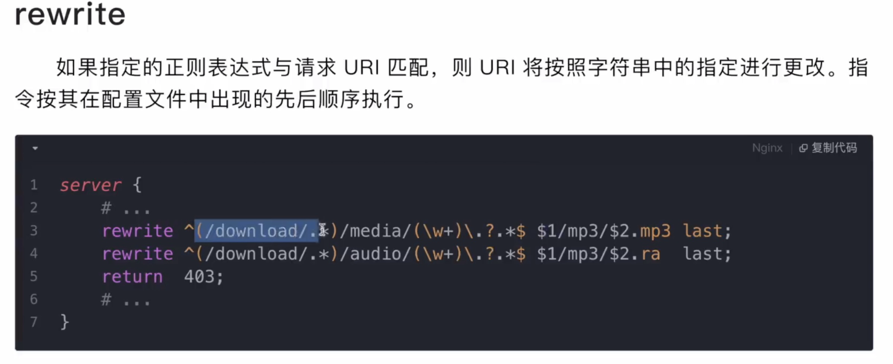
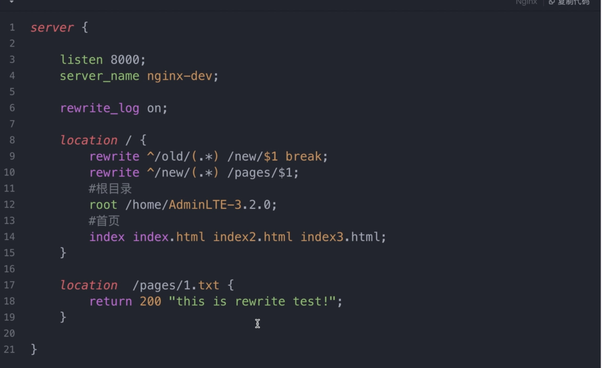
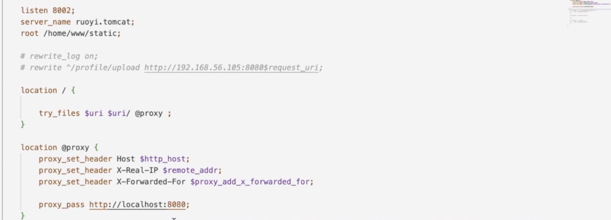

# APP

vscode plugin: remote ssh, nginx config


# 重定向


重定向是客户端的，如果你写 return 301, http://localhost:8088

访问的事客户端的8088，而不是nginx服务器的8088


## 状态码

2XX 成功

301 永久重定向 302 临时重定向

4XX 请求出错

5XX 服务器内部错误


# rewrite



```json
    location ~ /test.* {
        rewrite ^/test.*$ http://192.168.31.88:88/ break;
    }
```

把 http://192.168.31.88:88/test2 重定向到http://192.168.31.88:88/


last

break



Nginx rewrite 的last、break、redirect、permanent有四种模式：

 

last和break 都会跳转的rewrite的地址，区别是:

last跳转后，会重新发起请求再匹配一次location，而break则只进行跳转，不再重新请求。

当rewrite后的地址是一个直接可访问的地址时候，二者无区别

当rewrite后地址是本地地址，需要匹配location再次进行路由的时候，last会进行匹配，break则直接返回404

 

redirect和permanent都是重定向，区别是:

redirect是302，临时重定向，浏览器每次请求都请求原网址，搜索引擎不会记住新网址，而且还可能认为是作弊

permanent是301，永久重定向，浏览器缓存会记住新网址，当请求原网址，会直接向新网址请求，搜索引擎也会记住新网址。这样就可以减少中间过程，目的只是保留之前被大家熟知的域名


不加last，和break时 当你输入 /old/1.txt 会重写成 /new/1.txt 再重写成 / pages/1.txt

最后输出 this is rewrite test


 加了 break时，如图， 不会再去匹url 映射

直接去找 root配的  /home/AdminLTE-3.2.0/new/1.txt


**如果加last**， 不执行余下指令，重新从头匹配， 最后输出 this is rewrite test

```json
location /baidu {  
        proxy_pass http://www.baidu.com;  
        rewrite /baidu / break;  
}
```
会跳转到 http://www.baudu.com/baidu 所以要用rewrite把后面的/baidu去掉
[[nginx#rewrite route to baidu]]
# 动静分离



例如我们请求 http://ruoyi.tomcat:8002/image/404.png

$url  指的是 /image/404.png -> root 替换后是  /home/www/static/image/404.png

找不到再去找 $url/   -> root 替换后是  /home/www/static/image/404.png/

再找不到转http://localhost:8080/image/404.png