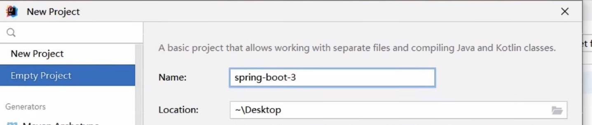
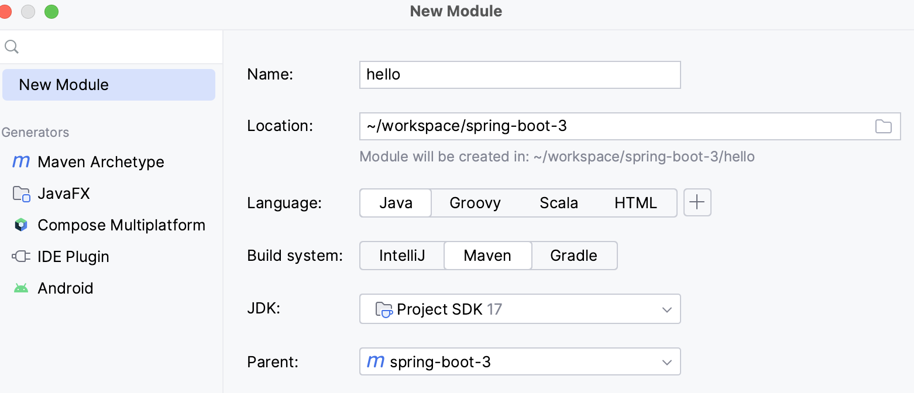
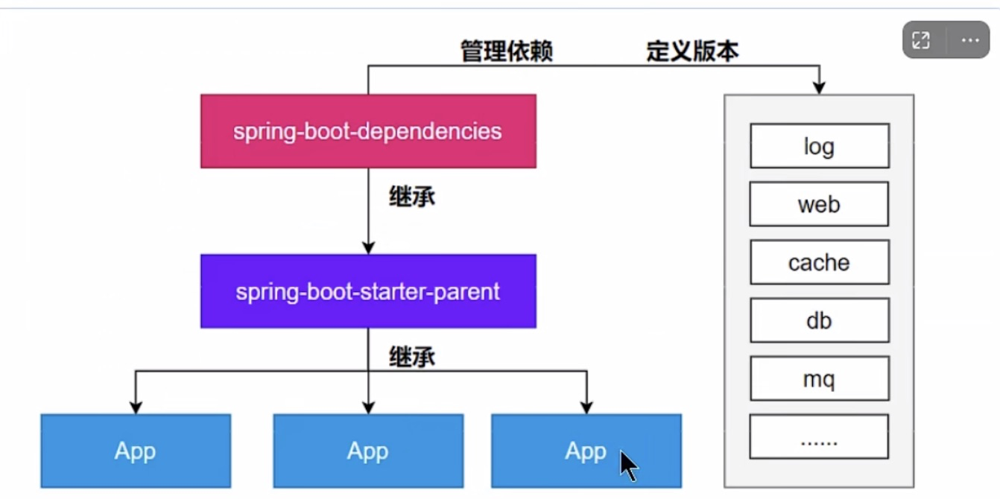
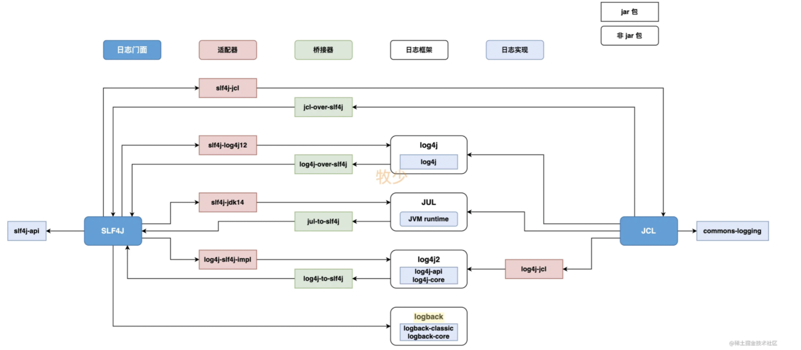
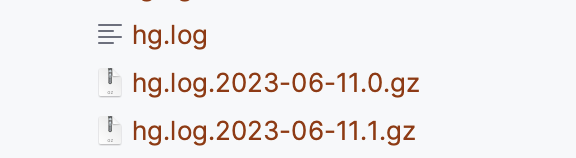
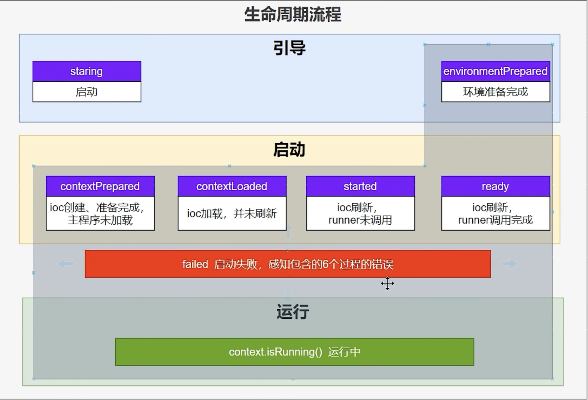
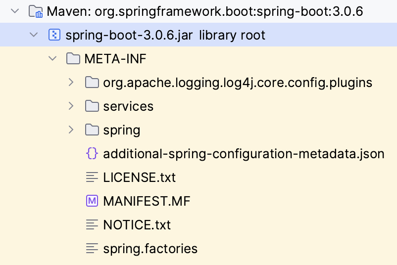
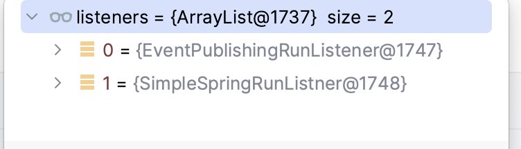
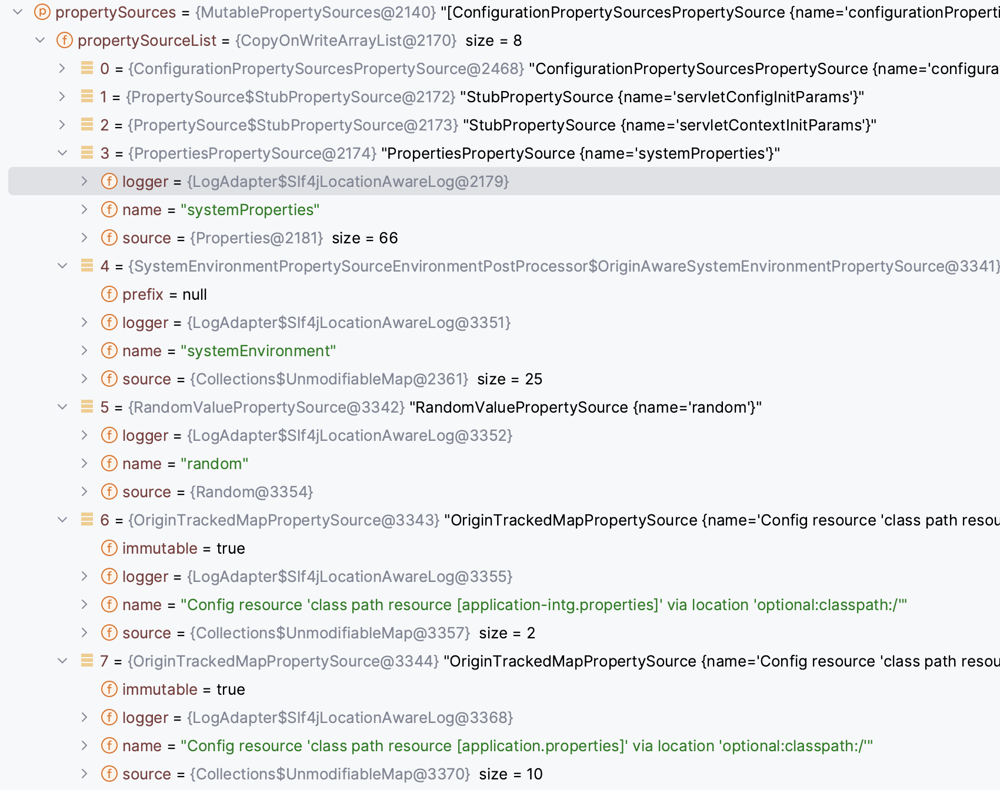

# Web page

https://spring.io/projects/spring-boot

[feature](# Features)

[Dependency tree](# Dependency tree)

## Features

- Create stand-alone Spring applications

- Embed Tomcat, Jetty or Undertow directly (no need to deploy WAR files)

- **Provide opinionated 'starter' dependencies to simplify your build configuration**

  - *No need import 10+ jars, intead using one spring starter* (spring-boot-web-starter...)

- **Automatically configure Spring and 3rd party libraries whenever possible**

  - default configure already there without manually input 

- Provide production-ready features such as metrics, health checks, and externalized configuration

- Absolutely no code generation and no requirement for XML configuration

- **Outside config**

  /app/demo.jar

  /app/application.properties  -> this file file ovr configures, no need rebuild a demo jar


# Create hello world

- Create empty project




- Create module under it



- Minimum pom

Parent -- spring-boot-starter-parent

Dependency -- spring-boot-starter-web

```xml
<?xml version="1.0" encoding="UTF-8"?>
<project xmlns="http://maven.apache.org/POM/4.0.0"
         xmlns:xsi="http://www.w3.org/2001/XMLSchema-instance"
         xsi:schemaLocation="http://maven.apache.org/POM/4.0.0 http://maven.apache.org/xsd/maven-4.0.0.xsd">
    <modelVersion>4.0.0</modelVersion>
    <parent>
        <groupId>org.springframework.boot</groupId>
        <artifactId>spring-boot-starter-parent</artifactId>
        <version>3.0.5</version>
    </parent>

    <artifactId>hello</artifactId>

    <properties>
        <maven.compiler.source>17</maven.compiler.source>
        <maven.compiler.target>17</maven.compiler.target>
        <project.build.sourceEncoding>UTF-8</project.build.sourceEncoding>
    </properties>
    <dependencies>
        <dependency>
            <groupId>org.springframework.boot</groupId>
            <artifactId>spring-boot-starter-web</artifactId>
        </dependency>
    </dependencies>
</project>
```


If you already with a parent then can import as a bom

```xml
    <dependencyManagement>
        <dependencies>
            <dependency>
                <!-- Import dependency management from Spring Boot -->
                <groupId>org.springframework.boot</groupId>
                <artifactId>spring-boot-dependencies</artifactId>
                <version>3.0.5</version>  <!-- Replace with your desired Spring Boot version -->
                <type>pom</type>
                <scope>import</scope>
            </dependency>
        </dependencies>
    </dependencyManagement>
```


set relative path empty can disable find pom in local path

==<relativePath/>==

```xml
    <parent>
        <groupId>org.springframework.boot</groupId>
        <artifactId>spring-boot-starter-parent</artifactId>
        <version>3.0.5</version>
        <relativePath/> <!-- lookup parent from repository -->
    </parent>
```


bootjar plugin

```xml
    <build>
        <plugins>
            <plugin>
                <groupId>org.springframework.boot</groupId>
                <artifactId>spring-boot-maven-plugin</artifactId>
            </plugin>
        </plugins>
    </build>
```


- app & controller

  ```java
  @SpringBootApplication
  public class MyApp {
      public static void main(String[] args) {
          SpringApplication.run(MyApp.class,args);
      }
  }
  ```

  ```java
  @RestController
  public class MyController {
      @GetMapping("/hello")
      public String hello() {
          return "hello";
      }
  }
  ```


# Dependency tree




# Log


any starter-> spring-boot-starter -> spring-boot-starter-logging


slf4j + logback


log文件加 -spring使spring接管


log4j2-spring.xml

logback-spring.xml

有了配置文件后，application properties 不再配置logging属性


==导入第三方项目时，先排掉日志包，使用slf4j桥接器，接到你的项目的slf4j上




```xml
  <dependencies>
    <dependency>
      <groupId>ch.qos.logback</groupId>
      <artifactId>logback-classic</artifactId>
      <version>1.4.6</version>
      <scope>compile</scope>
    </dependency>
    <dependency>
      <groupId>org.apache.logging.log4j</groupId>
      <artifactId>log4j-to-slf4j</artifactId>
      <version>2.19.0</version>
      <scope>compile</scope>
    </dependency>
    <dependency>
      <groupId>org.slf4j</groupId>
      <artifactId>jul-to-slf4j</artifactId>
      <version>2.0.7</version>
      <scope>compile</scope>
    </dependency>
  </dependencies>
```


use listener to load log system


Property name:

logging.XXX


Setup @ spring-boot.jar -- spring-configuration-metadata.json

```json
    {
      "name": "logging.pattern.console",
      "type": "java.lang.String",
      "description": "Appender pattern for output to the console. Supported only with the default Logback setup.",
      "sourceType": "org.springframework.boot.context.logging.LoggingApplicationListener",
      "defaultValue": "%clr(%d{${LOG_DATEFORMAT_PATTERN:-yyyy-MM-dd'T'HH:mm:ss.SSSXXX}}){faint} %clr(${LOG_LEVEL_PATTERN:-%5p}) %clr(${PID:- }){magenta} %clr(---){faint} %clr([%15.15t]){faint} %clr(%-40.40logger{39}){cyan} %clr(:){faint} %m%n${LOG_EXCEPTION_CONVERSION_WORD:-%wEx}"
    },
```


manually ovr @ properties file

```properties
logging.pattern.console=%d{yyyy-MM-dd HH:mm:ss} %-5level [%thread] %logger{15}: %msg%n
logging.level.root=INFO
logging.level.com.fansy.app.controller=DEBUG
logging.file.name=/Users/hg26502/workspace/spring-boot-3/hello/hg.log
logging.logback.rollingpolicy.file-name-pattern=${LOG_FILE}.%d{yyyy-MM-dd}.%i.gz
logging.logback.rollingpolicy.max-file-size=1KB
```



log group

```properties
logging.group.hg=com.fansy.app.controller,com.fansy.app
logging.level.hg=DEBUG

# springboot groups
logging.level.sql=DEBUG
logging.level.web=DEBUG
```


# Profiles

- 配置文件的分环境

​    application.properties

​    application-intg.properties


- bean的分环境

```java
@Bean
@Profile("intg")
public Person person() {}
```

```java
@Component
@Profile("intg")
Pblic class XXX
```


- 环境设置

  在properties文件里设

  ==*spring.profiles.active=intg*==

​	   在代码中设，命令行参数，java参数等等

```java
    public static void main(String[] args) {
        SpringApplication app = new SpringApplication(MyApp.class);
        Map<String, Object> defaultProperties = new HashMap<>();
        defaultProperties.put("spring.profiles.active","intg");
        app.setDefaultProperties(defaultProperties);
        app.run(args);
    }
```


## ConfigurationProperties

```java
@Component
@ConfigurationProperties(prefix = "common.hg")
public class Env {
    private String url;
    private long port;
```


```properties
##application.properties
spring.profiles.active=intg

##application-intg.properties
common.hg.url = www.baidu.com
common.hg.port = 80
```


```java
public class MyController {
    @Autowired
    private Env env;
```


# Junit

- @SpringBootTest("spring.profiles.active=intg")

会init 容器中beans,测试类必须用app的包路径，或子包路径

- dependency

  ```xml
          <dependency>
              <groupId>org.springframework.boot</groupId>
              <artifactId>spring-boot-starter-test</artifactId>
              <scope>test</scope>
          </dependency>
  ```

  会引入junit5 Mockito等


- Junit5

  @BeforeAll 只跑一次

  @BeforeEach 跑n次

- @ParameterizedTest
  @MethodSource("person")

  给测试类传参数


例子

```java
@SpringBootTest("spring.profiles.active=intg")
public class MainTest {
    Logger log = LoggerFactory.getLogger(MainTest.class);
    @Autowired
    Env env;
    String hostInfo;
    @BeforeEach
    public void init() {
        hostInfo = String.format("%s:%d",env.getUrl(),env.getPort());
    }
    @ParameterizedTest
    @MethodSource("person")
    public void testInitLoad(Person p) {
        log.info(String.format("name=%s,age=%d",p.getName(),p.getAge()));
        log.info(hostInfo);
    }
    static Stream<Person> person() {
        Person p = new Person();
        p.setAge(20);
        p.setName("Lee");
        return Arrays.asList(p).stream();
    }
}
```


# 生命周期





Listener file: spring.factories



```pro
# spring.factories
# Run Listeners
org.springframework.boot.SpringApplicationRunListener=\
org.springframework.boot.context.event.EventPublishingRunListener
```


可自定义Listener实现SpringApplicationRunListener接口

```java
public class SimpleSpringRunListner implements SpringApplicationRunListener
```



第一个是springboot系统配置的


SpringApplication events

## starting (拉listeners) 

## prepareEnrironment

导properties, outside setDefaultProperties传入的

```java

        if (!CollectionUtils.isEmpty(this.defaultProperties)) {
            DefaultPropertiesPropertySource.addOrMerge(this.defaultProperties, sources);
        }
```





## createApplicationContext

```java
    protected ConfigurableApplicationContext createApplicationContext() {
        return this.applicationContextFactory.create(this.webApplicationType);
    }
```

## prepareContext

Before refresh setup context other things

```java
private void prepareContext(DefaultBootstrapContext bootstrapContext, ConfigurableApplicationContext context, ConfigurableEnvironment environment, SpringApplicationRunListeners listeners, ApplicationArguments applicationArguments, Banner printedBanner) {
    
```

## refreshContext

this is most critical -- bean loadings

this.refreshContext(context);

## afterRefresh

nothing happen, started

## callRunners

this.callRunners(context, applicationArguments);